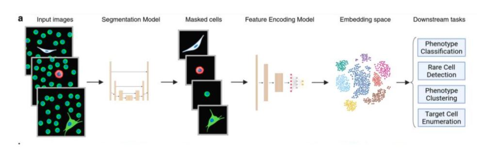

# CTC Detection from WSI
Pipeline for detecting circulating tumor cells from whole slide blood microscopy images. 
Has modules for loading in individual scans, segmenting and croping cells, and extracting features embeddings for downstream tasks

### Pipeline image


### Demo video
[](https://www.youtube.com/watch?v=z6A8fGhQNYg)

## Conda env
```
conda create --name cellpose python=3.10
conda activate cellpose
```
## Install reqs
```
python -m pip install -r requirements.txt 
```

## Run
cd to root directory
update config.yaml as needed
in pipeline.py, if using sample data, the offset should be 10 (or whatever number of sample images is used)
run `python src/pipeline.py`
check data/processed for embeddings for each cell found in the slide


## Project Structure
```
project/
├── data/
    ├──interim                  # not used but was planned to be where segmentation saved its state for extraction to load in
    ├──processed                # finals embeddings from extraction module go here
    ├──raw                      # WSI scans go here, They are loaded with hardcoded order so the order of the scans has to be dapi, ck, cd45, fitc. There is also a hardcoded number of scans per channel in config.yaml that must be updated

├── models/                     # not uploaded to the repo because of large size
    ├──cellpose_model           # for segmentatio
    ├──representation_learning  # for data extraction

├── src/
    ├──extractiton_module/
    ├──segmentation_module/
        ├──utils/ 
        ├──Base.py              # ABC class for all segmentation models to inherit from
        ├──Segmenter.py         # A cellpose segmentation class

    ├──pipeline.py              # Main file in which all the magic happens
    ├──config.yaml              # Hardcoded constants used in pipeline

├── requirements.txt            # pip install me  
```

## Outputs

Look for ```embeddings_with_pred.parquet.zip``` in ```data/processed``` 
